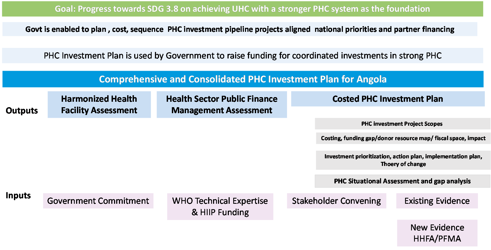

This chapter reproduces the *Proposal for Action* document that defines the HIIP engagement in Angola — the mandate everything else in this notebook works against. It is the World Health Organization (WHO) form submitted for the country, cleared by the HIIP Steering Committee on 28 April 2026.

The text is reproduced in full. What has been removed are the form's own instructions to whoever filled it in — prompts such as *"describe the issues in the health sector"* — which carry no information about Angola. The three annexes follow the sections, as in the original.

::: {.callout-note title="The proposal at a glance"}

| | |
|:--|:--|
| **Title** | Strengthening Primary Health Care in Angola through Harmonized Health Facility Assessment and Development of a PHC Investment Plan |
| **Country** | ANGOLA |
| **WHO region** | AFRO |
| **Estimated budget** | USD $786,542 |
| **WHO in-kind contribution** | $473,000 |
| **Team leader** | Tomas Valdez, Health Systems Team Lead, Angola |
| **Regional focal point** | Faisal Shaikh, Regional HIIP Coordinator |
| **Headquarters focal point** | Patrick Zuber |
| **Team members** | Omotola Akindipe, Victor Luteganya |
| **WHO Representative** | Indrajit Hazarika |
| **Coordination Committee** | 24th March 2026 |
| **Steering Committee** | 28th April 2026 |

:::

## 1. Context: Statement of the Problem

Angola continues to face substantial structural constraints across all primary health care operational levers despite a solid policy foundation for universal access. Ongoing administrative decentralization and socioeconomic pressures, including slowing economic growth, high inflation and widespread poverty, have weakened system performance and increased inequities. The predominantly public health system struggles with chronic underfunding, fragmented service delivery, infrastructure gaps, and shortages of qualified personnel, particularly in rural and peri-urban areas. A dual burden of communicable diseases together with rising noncommunicable diseases continues to place significant strain on PHC services.

Within this context, Angola has also recently implemented a new Political-Administrative Division, bringing the total number to 326 municipalities as of 1 January 2025 (previously 164) and number of provinces to 21 (previously 18). This reform focuses on decentralization to local government, converting several communes and districts into municipalities to bring governance closer to citizens. However, this administrative rearrangement has not been accompanied by the necessary resources, both in terms of human resources and health equipment and infrastructure.

The health system is structured in such a way that the primary health care network reports administratively to municipal administrators, who in turn report to the provincial government. The Ministry of Health maintains technical oversight of the health system and has administrative responsibility for health units at the national level. This dual management poses challenges in terms of shared responsibilities between the central, provincial, and municipal governments and makes it even more critical to ensure these resource flows are clarified and efficiently allocated to municipal health services (PHC).

As a result, the political and legal framework, anchored in the 1992 National Health Basic Law and reaffirmed through the 2022 Luanda Declaration on PHC, has not yet translated into effective implementation. Governance, regulatory and coordination gaps persist, particularly in relation to private providers, which represent more than half of facilities but contribute minimally to routine health information reporting. Mechanisms for multisectoral engagement and community participation remain limited, and service coverage remains low, with UHC Service Coverage Index and IHR SPAR scores below regional and global averages. In this context, the Government has formally reached out to WHO Angola to support the development of a national primary health care plan to guide implementation, presenting a real opportunity for impactful change.

Financing challenges continue to undermine PHC performance and highlight a significant need to strengthen public financial management systems in the country (see section 2 Health financing landscape section for detailed analysis). In addition, the absence of a costed PHC Investment Plan limits effective prioritization, partner alignment, and the efficient targeting of resources, meaning investments are fragmented and currently likely to result in less impact than they could.

Operational weaknesses further constrain PHC delivery. Routine immunization coverage remains low, community outreach is limited, and vertical programmes for HIV, tuberculosis, malaria and immunization remain only partially integrated with PHC, resulting in fragmented service delivery. Limited and outdated information on facility readiness, service quality and financial management reinforces the need for a national Harmonized Health Facility Assessment to generate comprehensive and standardized PHC evidence.

Human resources and infrastructure challenges persist, including uneven workforce distribution, the absence of updated workforce accounts, and persistent deficits in WASH, maintenance and waste management, particularly in rural areas. Regulatory capacity for medicines remains weak, and digital health systems continue to rely heavily on paper-based reporting with incomplete civil registration. Systems for quality of care, PHC-oriented research, and routine monitoring remain underdeveloped.

These structural weaknesses demonstrate the need for a comprehensive PHC investment plan that captures the priority actions necessary to improve primary health care in Angola and helps the country to move towards coordinated and targeted PHC investments rooted in national priorities. The Harmonized Health Facility Assessment and the Public Finance Management assessment will form key inputs for the development of the investment plan for PHC, enabling the gathering of critical data around gaps and identification of key financial management adjustments required to enable efficient and effective investment in PHC.

## 2. Health financing landscape

Angola’s health financing landscape shows gradual improvements in public investment but persistent structural constraints that limit progress toward universal health coverage. Overall, Angola’s financing environment is characterized by insufficient public spending, high out of pocket payments, dependence on volatile oil revenues and inefficient public financial management mechanisms.

In 2025, health expenditure represented 5.72 per cent of the General State Budget, far below Abuja Declaration of 15% of the State Budget to be allocated to health sector. This corresponds to 1.6 per cent of GDP (US$2.26 billion), yet current spending remains far below the levels required for countries at Angola’s income level to meet SDG 3 targets, i.e., at least the target of 5% of GDP.

Public financing accounts for 52 per cent of total health spending, while domestic private financing contributes to 43 per cent. Out-of-pocket payments represent 28.8 per cent of total health expenditure and remain a major barrier to access, particularly for poor and rural households. In the absence of formal social health insurance, the insurance coverage is extremely low at 0.6 per cent, leaving most of the population without any financial protection. External financing accounts for less than 5 per cent of spending, concentrated primarily in HIV, TB and malaria, increasing vulnerability as global funding declines.

Macro-fiscal pressures further constrain health financing. Angola’s dependence on oil for most revenue, combined with price volatility, currency devaluation and inflation, restricts fiscal predictability and undermines sustained PHC investments. Although public debt has declined, debt servicing absorbs more than half of annual government expenditure, and the IMF–World Bank classify Angola at moderate risk of debt distress.

In addition, while overall budget execution rates remain relatively high, significant discrepancies persist between approved budgets and funds authorized and transferred to the subnational (provincial and municipal) levels. For instance, in 2023, only 38% of the state's budget was allocated to provincial governments. In 2024, 34% of the planned amount was executed in the fourth quarter, reflecting a pattern of late-year execution like previous years. This centralized budgeting, inadequate allocation to sub-national level and delayed execution constrain subnational authorities' responsiveness and undermine the effectiveness of primary health care (PHC) service delivery in decentralized settings.

Across sectors, weak public financial management systems deepen these challenges. Limited performance-based budgeting, insufficient subnational oversight and irregular national health accounts (last NHA referred to 2006 to 2008) reduce transparency and constrain evidence-based allocation of resources. Currently, WHO is supporting the MoH to conduct the NHA covering the period 2020 to 2023 to institutionalize and conduct NHA on a regular basis. These structural weaknesses underscore the need for a public financial management assessment (PFMA) to identify the financing gaps, prioritize high impact interventions and support more efficient and predictable allocation of financial resources (particularly at sub-national level). This in turn will enable the country to more effectively plan its PHC investments and maximize the return on every dollar spent.

## 3. Ongoing WHO Support

WHO Angola continues to support the Ministry of Health in strengthening primary health care as the foundation of universal health coverage, in line with the WHO Country Cooperation Strategy 2023–2027 and national PHC commitments. The collaboration focuses on improved governance, service delivery, financing and health information, helping translate policy commitments into integrated, people-centered PHC services.

Across models of care, WHO provides technical leadership to strengthen essential services, integrate disease programmes and improve service quality. This includes support for the National Immunization Strategy 2026–2030, the national HPV vaccination campaign and ongoing work to improve maternal and child health through capacity-building, death reviews and community-based surveillance. WHO also supports integration of HIV, TB, malaria, and NCD interventions into PHC platforms, and contributes to improved access to safe and effective health products through revision of the National Essential Medicines List.

WHO continues to build PHC workforce capacity through training in maternal and newborn care, outbreak detection, IPC, childhood illness management and immunization, including zero-dose reduction and new vaccine introductions. These efforts help strengthen competencies at municipal and community levels and reinforce PHC performance in underserved areas. WHO plays an important role in improving data systems and PHC readiness. Support for DHIS2 expansion, the national Health Information Strategy and institutionalization of National Health Accounts is improving data quality and financial transparency. WHO also contributes to stronger emergency preparedness through enhanced surveillance, early warning systems, and community reporting, reflecting the need for reliable PHC-level data for planning and monitoring.

Regulatory strengthening remains a core focus. WHO continues to support ARMED to improve regulatory functions, implement the Quality Management System and update regulatory tools, helping ensure safe oversight of medicines, vaccines and technologies, as highlighted in WHO AFRO’s 2024 reporting.

All of this serves as a strong foundation for HIIP support. The HHFA and costed PHC Investment Plan will be built directly on this foundation and the strong relationship WHO has with MOH. Without WHO’s technical leadership, Angola would lack a standardized, globally validated assessment of PHC service availability, readiness and quality. WHO is uniquely positioned to link HHFA evidence to health financing, essential medicines reform, digital systems strengthening and PHC service redesign. Likewise, the PHC Investment Plan relies on WHO’s normative guidance, costing expertise and convening role to prioritize interventions, sequence reforms and align government and partners.

Together, these contributions demonstrate WHO’s unique and essential role in supporting the MOH, providing the technical and strategic backbone needed to accelerate PHC transformation in Angola and ensure that reforms are evidence-driven, implementable and sustainable.

## 4. Ongoing Development Partners Support

Angola benefits from a small but strategically important group of development partners whose support aligns with national priorities for PHC and health system strengthening.

The World Bank is a key contributor through the Health System Resilience and Primary Health Care Strengthening Project (P180631), which focuses on improving essential services at community and PHC levels, enhancing emergency preparedness, strengthening surveillance and supply chains and supporting maternal, child and reproductive health. The project also advances financial protection and multisectoral human capital development while facilitating bilateral cooperation with Cuba, Portugal and Brazil to ease workforce shortages.

The African Development Bank (AfDB) support increasingly aligns with decentralization, infrastructure development and improvements to data and governance systems, reinforcing the importance of stronger PHC readiness and service quality as enablers of inclusive growth.

The European Union and the United States are expanding multisectoral investments linked to the Lobito Corridor, with entry points in health infrastructure, digitalization and innovation under the EU Global Gateway. These engagements create opportunities to strengthen PHC through improved connectivity, service access, and digital health systems.

The European Investment Bank (EIB) project on COVID-19 Health Resilience is supporting the national authorities on the acquisition of medical equipment and supplies, medicines, logistics, vaccines and vaccination campaigns, as well as the strengthening of the medical heath system from a pandemic preparedness viewpoint.

Across the UN system, UNFPA is preparing a selective EmONC and RH commodities readiness assessment that will generate essential evidence on service quality and supply chain gaps. UNICEF is contributing resources and technical support for child health and immunization, creating opportunities to align assessments and facility level data. UNDP and the Global Fund continue to strengthen health information systems for HIV, TB, malaria, and reproductive health in selected provinces, working with WHO to support integration into national HIS reforms.

Nevertheless, in the absence of an active national health strategic plan, these contributions remain valuable but fragmented. Specific data around donor investments remains patchy, highlighting the importance of donor resource mapping as part of this TA. Development of the PHC Investment Plan under the HIIP, creates a unique opportunity for the country to build on current momentum in the country, unify partner efforts through the PHC Technical Working Group and guide coordinated investments that advance Angola’s PHC reform agenda.

## 5. Alignment with health-related Sustainable Development Goals

The proposed technical assistance directly contributes to the achievement of health-related Sustainable Development Goals by generating the evidence and strategic direction required to accelerate progress on key SDG targets and indicators. The HHFA will provide a comprehensive benchmark of service availability, readiness, quality, management capacity and financing at all levels of care, enabling Angola to identify gaps and inform investment priorities that strengthen essential health services. These improvements support SDG 3.1, which aims to reduce the maternal mortality rate to fewer than 70 deaths per 100,000 live births, through enhanced monitoring of service readiness for emergency obstetric and newborn care and improved coverage of skilled birth attendance, reflected in indicators 3.1.1 and 3.1.2. Strengthening PHC service delivery through HHFA evidence also underpins SDG 3.8 on universal health coverage by improving the quality and equity of essential services, tracked through indicator 3.8.1 on service coverage and indicator 3.8.2 on financial protection.

The PHC Investment Plan and HHFA additionally contribute to SDG 3.d by strengthening Angola’s capacity for early warning, risk reduction and management of health emergencies. By assessing facility preparedness, surveillance functions, infection prevention and control and antimicrobial resistance, the assessment provides critical data aligned with indicators 3.d.1 on IHR capacities and 3.d.2 on bloodstream infections due to antimicrobial-resistant organisms. These insights will help guide national strategies for strengthening emergency preparedness and response.

The costed PHC Investment Plan, supported by the PFMA, will further advance SDG 3.c, which calls for increased health financing and the development, training and retention of the health workforce. By defining priority interventions, resource needs and long-term investment pathways, the plan will guide national and partner financing toward improved PHC staffing, equitable distribution of health workers and enhanced quality of care, aligned with indicator 3.c.1 on health worker density and distribution. Together, the HHFA and the PHC Investment Plan provide the evidence, prioritization and financing roadmap necessary to accelerate Angola’s progress toward the health-related SDGs.

## 6. Alignment with country strategies of HIIP MDBs

The proposed technical assistance aligns closely with the priorities of multilateral development banks active in Angola, particularly the European Investment Bank (EIB) and the African Development Bank (AfDB). Both institutions emphasise human capital development, stronger governance, and improved basic services as prerequisites for inclusive growth.

The EIB, under the EU Multi-Annual Indicative Programme 2021–2027, focuses on human development, institutional strengthening, and more effective public administration. The MIP highlights ongoing weaknesses in sector planning, data quality and transparency, noting that these undermine service delivery and human development outcomes. The TA responds to these gaps by improving routine data quality, strengthening monitoring, and enabling more informed prioritization of PHC investments. The Investment Plan offers a structured framework that can guide future EIB and Team Europe support, including digitalisation, governance reforms and efforts to improve equitable access to essential services.

The AfDB Country Strategy Paper 2024–2029 identifies low human capital, weak institutional capacity, and poor-quality social services as key constraints. It prioritizes improved public financial management, strengthened governance in social sectors, better data systems, and more decentralized service delivery. The HHFA directly contributes to these aims by providing nationally standardized evidence on service availability, readiness and quality, enabling Angola to target investments more effectively and reduce regional disparities. The costed PHC Investment Plan supports AfDB’s focus on institutional capacity by creating a sequenced roadmap for PHC investment, budgeting and long-term planning.

## 7. Political buy-in and Strategic Relevance

Angola has shown sustained political commitment to advancing universal health coverage through a stronger primary health care system. Recent investments have expanded service capacity and improved infrastructure across all levels of care, supported by a series of high-level decisions that reaffirm PHC as the foundation of the national health system.

The Luanda Declaration on Primary Health Care (2022) set eight national commitments to accelerate PHC as the path to UHC, prioritizing equitable access, integrated services, community participation, and strengthened public health functions. The National Health Policy (2020) further positions PHC as the organizing principle of the system, with emphasis on service quality and integration.

Momentum has increased through recent policy actions. In November 2024, the Council of Ministers reviewed the Lei de Bases do Sistema de Saúde (Basic Health Law), signaling renewed commitment to modernizing the legislation that defines governance, service organization and institutional responsibilities. The same session advanced reforms in social protection, administrative processes and higher education, reinforcing broader institutional strengthening in support of PHC transformation. In this context, the Ministry of Health has requested WHO to lead in the development of the national PHC strategy in collaboration with key stakeholders that should be finalized by 2026.

National planning instruments also reflect this direction. The National Development Plan (2023-2027) prioritizes PHC delivery in areas including NCDs, neglected tropical diseases, and reproductive health. A 2024 presidential directive calls for stronger data systems, better interoperability and alignment of partner support with PHC priorities, underscoring the Government’s commitment to evidence-based planning. Moreover, the recent request from the Ministry of Health for WHO’s support on PHC is another testimony to take forward the work on PHC reforms.

Nevertheless, there is a need to take forward the policies and commitments of the country and enable effective implementation to deliver the desired impact. Within this context, the HHFA and the costed PHC Investment Plan are strategically aligned with national reforms but provide practical steps to identify bottlenecks and aid effective decision making to resolve them. These outputs will provide the evidence and structured investment roadmap required to translate political commitments into practical, sequenced actions. By strengthening data on service readiness and clarifying priority gaps, the proposed technical assistance supports coherent implementation of Angola’s PHC vision and reinforces the basis for sustained reform and effective financing decisions.

## 8. MOH and MOF Ownership

Is there proactive support from MoH for this Investment Plan? (YES)

Has MOH agreed to the Investment Plan's concept, scope, and design? (YES)

Will MOH be substantially involved in carrying out the activity? YES?

YES. Overall implementation, supervision, and oversight will be led by the WHO Country Office in Angola, in close coordination with the Ministry of Health at central and provincial levels, including the National Public Health Directorate (DNSP), the Planning, Statistics and Studies Cabinet (GEPE), and Provincial Health Directorates.

Collaboration will also involve NGOs, civil society organizations, and other UN agencies and international partners working at a subnational level.

The Ministry of Health has formally requested WHO Angola’s technical support on this important priority. An official letter indicating interest in participation in HIIP and endorsing the TA activities (investment plan scope and design) has been secured and is annexed. A Primary Health Care-Technical Working Group has also been constituted by MOH indicating that MOH be substantially involved in carrying out the activity with support from WHO.

As part of the implementation, the decentralized/subnational levels of units –– provinces and municipalities – will be involved in all phases. This includes membership of the technical working group, involvement in the HHFA and PFMA exercises, as well as engagement in the validation of the investment case.

MOH is able and willing to fund part of the Technical Assistance for the implementation of the HHFA as well as the finalization of the Investment Plan by providing working space as well as key information that will be crucial for prioritization and efficient resource allocation.

MOH Primary Contacts

Main contact:

Name: Dr. Pedro Duarte

Title: Director, National Statistics, Planning and Studies, MoH

Phone: +244 921 061 774

Email: pedroduarteg584@gmail.com

Alternate contact:

Name: Dr. Ketha Francisco

Title: Head of Primary Health Care and Maternal Health Unit, MoH

Phone: +244 923 715 091

Email: bhaibbyketha@yahoo.fr

## 9. Activity Description

The proposed technical assistance package is structured around three interlinked subcomponents designed to deliver a single, overarching outcome. The primary deliverable of the project is a costed PHC Investment Plan, informed by a HHFA and a PFMA. Together, these subcomponents establish a coherent pathway from system diagnosis to strategic and costed PHC reform.

Primary Deliverable: A Comprehensive and Consolidated PHC Investment Plan

- Main component: PHC Investment Plan

Deliverable 1: Costed PHC Investment Plan developed and launched

The Costed PHC Investment Plan will produce a structured, multi-year plan grounded in the 14 levers of the WHO-UNICEF Operational Framework for Primary Health Care.

Key intermediate outputs include:

- Situation assessment of PHC across the 14 levers (e.g., governance, funding, integrated services, workforce, quality improvement). The PHC situation assessment will include a dedicated section on decentralization that maps roles and responsibilities across government levels,

- Donor resource mapping gaps, synergies with government/donor funds (e.g., HIIP, World Bank, AfDB), avoiding duplication, and assessing potential impact.

- Gap analysis based on HHFA findings from 619 facilities, identifying priority bottlenecks in readiness, inputs, and performance.

- Prioritization of interventions through TWG consultations, defining short-, medium-, and long-term actions across 14 levers

- Investment action and implementation plan, including theory of change, clear responsibilities, monitoring indicators across 14 PHC operational levers. The governance section of investment packages will outline the policy, strategic, operational, and capacity-building needs for effective PHC planning, budgeting, supervision, and service delivery at provincial and municipal levels.

- Costing of the plan with realistic, evidence-based estimates. As part of project costing, the impact can be assessed through projected service utilization rates (such as outpatient visits, vaccinations, ANC, and deliveries), estimated by linking one-unit changes in PHC inputs (using HHFA data and routine health information systems) to corresponding changes in outputs, including marginal costing of additional human resources. The costed investment plan will also include adjustment factors in the form for remote municipalities or municipalities with poor health coverage indicators to promote equity agenda.

- Development of Project scopes for focused investments.

Delivery of the technical assistance activities will include analytical work, technical working group meetings, consultative and validation workshops, and dissemination through targeted communication products, culminating in the official launch of the PHC Investment Plan.

To lay the groundwork for the investment planning and gather the inputs required to develop the Costed PHC Investment Plan, HHFA and PFMA will also be carried out.

2. National Harmonized Health Facility Assessment (HHFA)

Deliverable 2: National HHFA report and dissemination of findings

Overview: The HHFA will generate the first nationally standardized dataset on PHC availability, readiness and quality of care across approximately 20 percent of primary care facilities nationwide. Preparatory maturity is already at an advanced level, with the planning in the form of PHC TWG leading scope and design (including obtained facility lists and survey sites), equipment secured, and consultant TORs developed.

Activities include adaptation of HHFA tools and protocols, training of enumerators and supervisors, nationwide data collection, and analysis and interpretation of findings. Provincial and municipal representatives will be consulted during planning, tool adaptation, and sampling to reflect local realities and priorities. Stratified sampling with explicit oversampling or targeted inclusion of remote/rural strata, based on geographic, demographic, and access indicators, could be undertaken to avoid "tail" risks and overlooking capital gaps. Subnational teams will contribute to data interpretation, validation of findings, and identification of context-specific bottlenecks, with regular feedback loops (e.g., via provincial focal points) ensuring ongoing involvement.

The HHFA will highlight critical gaps in availability, readiness, and quality of service provision in PHC feeding into the gap analysis component of the PHC Investment Plan. This will provide the empirical evidence required to identify system weaknesses, inequities, and priority investment areas for PHC strengthening. The proposed sampling methodology will enable us to present a representative PHC situation in the country and require less resources and time than alternative approaches such as a census. Additionally, using a sampled approach will enable identification of medium to long term actions that are comprehensive across all 14 levers of PHC strengthening, thereby reducing fragmentation in how investments are directed towards PHC. As the outputs of this assessment will provide up to date information to guide the PHC investment plan, focusing on this sampled priority facilities will allow us to develop specific project scopes based on actual gaps and needs.

In addition, the HHFA allows us to directly address the challenge of fragmentation in PHC financing, which stems from inadequate information on capital investment needs at both national and subnational levels. The HHFA fills this critical information gap by providing detailed, actionable data on facility-level and system-wide requirements, enabling precise identification of short- to long-term capital investment needs and supporting more coherent and targeted financing decisions by government and partners.

3. Health Sector Public Finance Management Assessment (PFMA)

Deliverable 3: PFMA report validated at national level

The PFMA will assess public finance management bottlenecks (such as the substantial gap between approved and authorized budgets) that constrain PHC performance, including budget formulation, allocation, execution, procurement and accountability mechanisms at national, sub national and facility level. Through stakeholder consultations, data collection, and technical analysis, the PFMA will examine how resources flow from national to subnational levels and how they are utilised at service delivery points. The Public Finance Management Assessment will analyze fiscal flows and transfers to ensure adequate resources for municipalities to ensure PHC reinforcement in the decentralization agenda;

Delivery of this component of the TA will include consultant recruitment, documentation review, data collection through the facility survey, and key informant interviews, analysis, report writing, and validation.

It is essential to undertake the PFMA ahead of the investment planning work, as its validated findings will identify priority areas for PFM adjustments. Effective PHC financing depends on agile PFM systems that support aligned budgeting, timely disbursement, adequate flexibility in the use of resources, and strong reporting and accountability mechanisms. At present, Angola’s PFM system does not provide the enabling environment required for effective PHC spending. The assessment will identify the key PFM bottlenecks affecting PHC and present corrective actions to be jointly implemented by health and finance authorities ahead of any potential investments.

In turn, the PFM assessment will enable better execution of PHC related investment financing through identifying challenges and solutions to promote better management of procurement and ensure fiduciary risk management. The PFMA will complement the ongoing NHA exercise linking budget allocation and execution realities (PFMA) with actual spending behavior (NHA), enabling more accurate costing and fiscal space analysis for proposed PHC investments, and supporting the design of realistic, implementable, and fiscally sustainable PHC financing reforms and investment packages surrounding sub-national institutional capacity and facility level investments.

## 10. TA objectives and results

Fill in the table below with the objectives and related outputs that are expected to be achieved by the completion of this project. The primary objective of the TA should be the production of a PHC Investment Plan.

## 11. Budget Summary

::: {.callout-warning title="Left blank in the source document"}
This section carries only the form's prompt in the original document; no answer was filled in.
:::

## 12. Risks to achieving objectives

::: {.callout-warning title="Left blank in the source document"}
This section carries only the form's prompt in the original document; no answer was filled in.
:::

## 13. Dissemination and Outreach Strategy

The dissemination and outreach approach will ensure that the costed PHC Investment Plan is fully understood, used, and integrated into national decision-making. Dissemination will prioritize accessibility, ownership, and uptake across national and subnational levels.

All final documents, including the PHC Investment Plan as well as the HHFA report and PFMA findings, will be produced in Portuguese, with executive summaries in both Portuguese and English to facilitate broader development partner engagement. These materials will be made publicly available through the Ministry of Health and WHO websites and shared through sectoral coordination mechanisms.

To support policy uptake, the results will be presented in a high-level national validation workshop chaired by MINSA, involving the Ministry of Finance, Ministry of Planning, provincial health directorates, regulatory authorities, and key stakeholders. Additional technical briefings will be held with senior policymakers to support the integration of findings into annual planning, budgeting cycles, and sector strategies.

At subnational level, dissemination will include provincial feedback sessions, ensuring that provincial health authorities understand facility-level findings and can translate recommendations into local plans.

A targeted partner outreach strategy will ensure alignment with development partners to support coordinated financing discussions linked to the PHC Investment Plan. Findings will also be shared through health sector coordination groups and technical working groups.

## Annex 1 — Problem and solution tree

The original renders this as a seven-column table. It is reproduced here as one block per objective, which is the same content in a form that can actually be read on a screen.

### O1 — Output 1.1 Costed PHC Investment Plan developed.

| | |
|:--|:--|
| **Causes** | 1.1.1 Lack of strategic and operational direction for PHC investment. |
| **Causal consequences** | 1.1 Inefficient allocation of available resources for PHC. |
| **Problems to be solved** | Proportion of population with large household expenditures on health as a share of total household expenditure or income. |
| **Activities to solve defined problems** | Activity 1.1.1 Develop a costed PHC Investment Plan. |
| **Outcomes** | O1. To develop a costed PHC Investment Plan that provides a strategic roadmap for scaling up PHC through investment pipelines, aligned with existing policies and WHO’s normative guidance. |
| **Goal** | Primary health care and health services that are high quality, safe, comprehensive, integrated, accessible, available and affordable for everyone and everywhere, provided with compassion, respect and dignity by health professionals who are well-trained, skilled, motivated and committed. |

### O2 — Output 2.1 Comprehensive National Harmonized Health Facilities Assessment report.

| | |
|:--|:--|
| **Causes** | 1.1.1 Lack of strategic and operational direction for PHC investment. |
| **Causal consequences** | 1.1 Inefficient allocation of available resources for PHC. |
| **Problems to be solved** | Low coverage of essential health services. |
| **Activities to solve defined problems** | Activity 2.1.1 Conduct Harmonized Health Facilities Assessment in 619 health facilities. |
| **Outcomes** | O2. To generate standardized, comprehensive data on service availability, readiness, and service quality across all levels of care, especially at the PHC level informing gaps for PHC Investment plan. |
| **Goal** | Primary health care and health services that are high quality, safe, comprehensive, integrated, accessible, available and affordable for everyone and everywhere, provided with compassion, respect and dignity by health professionals who are well-trained, skilled, motivated and committed. |

### O3 — Output 3.1 Health sector Public Finance Management (PFM) assessment.

| | |
|:--|:--|
| **Causes** | 1.1.1 Lack of strategic and operational direction for PHC investment. |
| **Causal consequences** | 3.1 Inefficiency utilization of available resources |
| **Problems to be solved** | Inadequate execution rate of health sector approved budget at primary care. |
| **Activities to solve defined problems** | Activity 3.1.1 Conduct PFMA for the health sector in Angola. |
| **Outcomes** | O3. To identify principle public finance management (PFM) bottlenecks that impact health sector financing and health services delivery and put in place solutions to ensure that proposed PHC investments are realistic, fiscally grounded. |
| **Goal** | Primary health care and health services that are high quality, safe, comprehensive, integrated, accessible, available and affordable for everyone and everywhere, provided with compassion, respect and dignity by health professionals who are well-trained, skilled, motivated and committed. |

## Annex 2 — Deliverables, activities and timeline

In the source document the schedule is drawn with shaded cells and no text. The months below were recovered from that shading.

| Deliverable / activity | M1 | M2 | M3 | M4 | M5 | M6 | M7 | M8 | M9 | M10 | M11 | M12 |
|:---|:-:|:-:|:-:|:-:|:-:|:-:|:-:|:-:|:-:|:-:|:-:|:-:|
| **Main Deliverable 1: Costed PHC Investment Plan developed and launched** | | | | | | | | | | | | |
| Activity 1: Consultants Recruitment | ● |  |  |  |  |  |  |  |  |  |  |  |
| Activity 2: PHC desk review, situation assessment |  | ● | ● |  |  |  |  |  |  |  |  |  |
| Activity 3: Identification on priority interventions guided by the 14 WHO UNICEF Operational Framework levers |  |  |  |  |  | ● | ● |  |  |  |  |  |
| Activity 4: Costing of the prioritized interventions |  |  |  |  |  |  | ● | ● | ● |  |  |  |
| Activity 5: Stakeholder Consultations & Validation Workshop |  |  |  |  |  |  |  | ● | ● |  |  |  |
| Activity 6: Drafting Investment Plan (sequencing, costing, TOC with indicators, project scopes) |  |  |  |  |  |  | ● | ● | ● |  |  |  |
| Activity 7: Finalization, High-level Presentation & launching |  |  |  |  |  |  |  |  |  | ● | ● |  |
| Activity 8: Pipeline project scope development |  |  |  |  |  |  |  |  |  | ● | ● | ● |
| **Deliverable 2: National Harmonized Health Facilities Assessment report** | | | | | | | | | | | | |
| Activity 1: Consultant Recruitment | ● | ● |  |  |  |  |  |  |  |  |  |  |
| Activity 2: TWG Orientation & HHFA tools adaptation |  |  | ● | ● |  |  |  |  |  |  |  |  |
| Activity 3: Training field teams |  |  |  | ● |  |  |  |  |  |  |  |  |
| Activity 4: HHFA Data Collection |  |  |  | ● | ● |  |  |  |  |  |  |  |
| Activity 5: Data Cleaning, gap analysis, and Report Writing |  |  |  |  | ● | ● | ● |  |  |  |  |  |
| HHFA findings informing the PHC investment plan prioritization |  |  |  |  | ● |  |  |  |  |  |  |  |
| **Deliverable 3: Health Sector Public Finance Management (PFM) assessment.** | | | | | | | | | | | | |
| Activity 1: Consultants Recruitment | ● |  |  |  |  |  |  |  |  |  |  |  |
| Activity 2: PFMA TWG Orientation |  | ● |  |  |  |  |  |  |  |  |  |  |
| Activity 3: PFMA Field Data Collection & Key Informant |  | ● | ● | ● | ● |  |  |  |  |  |  |  |
| Activity 4: PFMA Analysis & final report |  |  |  |  | ● | ● |  |  |  |  |  |  |
| PFMA finding informing the PHC investment plan |  |  |  |  | ● |  |  |  |  |  |  |  |
| HIIP Project technical and financial report |  |  |  |  |  | ● |  |  |  |  |  | ● |

## Annex 3 — Theory of change

{#fig-toc fig-align="center"}

## Contacts

For more information, please send an email to akindipeo@who.int & valdezt@who.int, shaikhf@who.int Faisal Shaikh, Regional HIIP Coordinator copied to the HIIP secretariat: hiip_secretariat@who.int.
