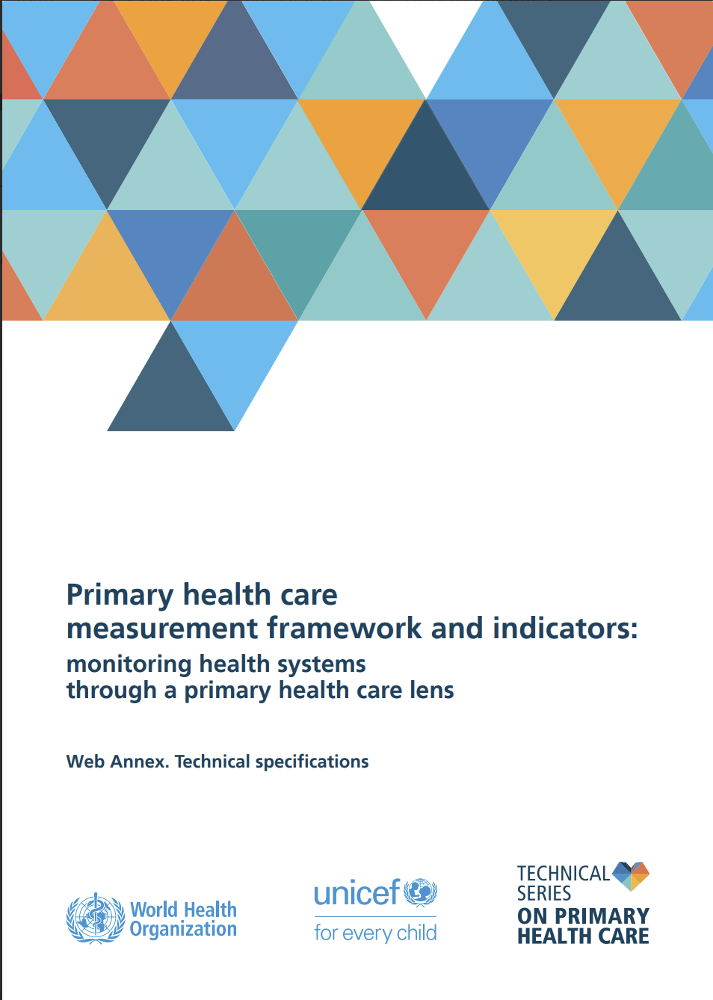

# The PHC Measurement Framework and Indicators

{width=40%}

## What it is and what it is for

The Primary Health Care (PHC) Measurement Framework and Indicators is a joint World Health Organization (WHO) and United Nations Children's Fund (UNICEF) publication from 2022. It is the official measurement framework for the Declaration of Astana and for the Operational Framework for PHC, and it answers the request of Member States in resolution WHA72.2 for guidance on how to assess and track PHC performance.

It comes in two documents. The main document (48 pages) presents the conceptual framework, the monitoring logic and the menu of indicators. The Web Annex (technical specifications) gives one metadata sheet per indicator: 96 sheets in total.

The framework is a menu, not a mandatory list. Countries select the indicators that fit their priorities and data systems, and are expected to embed PHC monitoring in the review cycle of the national health strategy rather than create a parallel process.

Its relation to the other frameworks in this book:

- The Operational Framework for PHC (2020) defines what to do: 14 levers, 4 strategic and 10 operational. The Measurement Framework defines how to know whether it is being done. Every indicator is tied to a lever.
- The Harmonized Health Facility Assessment (HHFA) is one of the data sources the framework names. It is a facility survey; the framework also draws on routine information systems, population surveys, national accounts and qualitative assessment. The crosswalk in the HHFA critical analysis chapter measures how much of the framework the HHFA can reach.

## Structure

### The monitoring logic

The framework organizes the health system in a results chain. The indicators in the Web Annex sit in four monitoring and evaluation (M&E) domains:

| M&E domain | Indicators |
|---|---|
| Inputs | 23 |
| Structures | 22 |
| Processes | 20 |
| Outputs | 31 |

No indicator in the 96 is classified as an outcome or impact measure. For outcomes (health status, financial protection, responsiveness, equity) the framework points to the existing monitoring of universal health coverage (UHC) and the Sustainable Development Goals (SDGs) rather than defining new indicators. This is the same structural limit found in the HHFA: the instrument measures what the system has and does, and stops at outputs.

### Two tables and three cross-cutting lists

The Web Annex has three parts.

Section 1, Table 1: 87 core indicators, numbered 1 to 87, grouped in 13 domains (sections 2.1 to 2.13). Each row gives a short definition, possible disaggregations, the level at which the indicator applies (national, subnational, facility), the preferred data source and the tier.

Section 1, Table 2: 9 additional hospital-oriented indicators, lettered A to I (section 2.14). These have no tier.

Section 2: the 96 metadata sheets.

Section 3: three tables that mark indicators already in the list as relevant to quality (3.1), equity (3.2) or resilience (3.3), each with a short "consideration" text. These tables do not create new indicators. In the workbook the marks come to 37 for quality, 19 for equity and 25 for resilience (81 marks in total); 34 indicators appear in none of the three.

### Domains

The 13 core domains, in the order of the Web Annex, with the number of indicators in each (counted from the Web Annex, sections 2.1 to 2.13).

| Section | Domain | Indicators |
|---|---|---|
| 2.1 | Governance | 9 |
| 2.2 | Adjustment to population health needs | 4 |
| 2.3 | Financing | 8 |
| 2.4 | Physical infrastructure | 5 |
| 2.5 | Health workforce | 3 |
| 2.6 | Medicines and other health products | 4 |
| 2.7 | Health information | 8 |
| 2.8 | Digital technologies for health | 3 |
| 2.9 | Models of care | 15 |
| 2.10 | Systems for improving quality of care | 1 |
| 2.11 | Resilient health facilities and services | 1 |
| 2.12 | Access and availability | 12 |
| 2.13 | Quality care | 14 |
| 2.14 | Additional hospital-oriented (A to I) | 9 |

Governance, Financing and Adjustment to population health needs hold most of the qualitative indicators. Models of care, Access and availability and Quality care hold most of the quantitative ones.

### Tiers, levels and the global core

Tier 1 indicators are the recommended priority set; Tier 2 indicators are for countries with the data systems to support them. 13 indicators carry the mark "Tier 1 + Global", meaning they also belong to the global core set used for cross-country reporting.

Level states where the indicator is measured: national, subnational, facility, or a combination. This field is the basis of the finding, in the HHFA chapter, that only 46 of the 96 indicators can be measured at facility level at all.

### Qualitative and quantitative indicators

33 of the 96 indicators are qualitative. Their numerator and denominator are both "Not applicable", and they are assessed against a list of criteria in the definition field. The preferred data source for these is key-informant interview or document review, and several point to an existing tool (the SCORE assessment instrument, the Health Financing Progress Matrix). The other 63 have a numerator and a denominator and are computed from routine data, surveys or facility assessments.

## What an indicator sheet contains

Each sheet in Section 2 has the same fields: indicator short name; indicator long name; domain; subdomain; M&E domain; definition (with the assessment criteria, for qualitative indicators); disaggregations; numerator; denominator; preferred data source; existing data collection tool; rationale; references; notes. Level and tier are not on the sheet; they come from Table 1.

### Worked example: indicator 10

This is the indicator used to agree the extraction structure before the full workbook was built.

| Field | Content |
|---|---|
| Number | 10 |
| Block | Core (Table 1), section 2.2 |
| Domain | Adjustment to population health needs |
| Subdomain | Monitoring and evaluation |
| M&E domain | Structures |
| Short name | Priority setting is informed by data and evidence |
| Long name | Policy priority setting is informed by data and evidence on health priorities, burden of disease, population risk and equity analysis |
| Definition | Priority setting in the national health strategic plan or policy is based on data and evidence, measured against key criteria |
| Criteria (9) | (1) review of past performance over the last five years; (2) burden of disease analysis identifying populations at higher risk; (3) subnational performance data and analysis; (4) disaggregation by gender responsiveness; (5) disaggregation by populations in situations of vulnerability; (6) disaggregation by spatial inequities; (7) systematic stakeholder engagement; (8) a central unit or function in the Ministry of Health that translates data into policy action; (9) resource allocation based on the result of the prioritization |
| Numerator, denominator, disaggregations | Not applicable |
| Level | National; subnational; facility |
| Preferred data source | Qualitative assessment: key-informant interview and/or document review |
| Existing tool | SCORE assessment instrument (WHO) |
| Tier | Tier 1 (not in the global core) |
| Cross-cutting | Equity: yes. Quality: no. Resilience: no. |
| Rationale (summary) | Resources are never unlimited, so priorities must be set. The choices reflect the values and vision of society, made after the situational analysis against criteria defined by sector stakeholders, and the result feeds the national health policy, strategy or plan. |
| References | SCORE for health data technical package (2021); Operational Framework for PHC (2020) |
| PDF page | 30 |

The example shows the general pattern of a qualitative indicator: a yes/no or scaled judgement per criterion, no rate, and a national-level assessment method that a facility survey cannot replace.

## The indicator workbook

`WHO_UNICEF_PHC_Measurement_Framework_Indicators.xlsx` was extracted from the Web Annex with coordinate-based parsing (pdfplumber), because the PDF text layer doubles every character on some pages. Five tabs:

- Indicators: 96 rows, 32 columns. Frozen panes and filters on. Rows with a source anomaly are shaded.
- Criteria: 448 rows, one per assessment criterion, with indicator number, domain and criterion number. This is the tab for questions such as how many criteria across the framework concern disaggregation by gender.
- Cross_cutting: 81 rows, one per mark in Tables 3.1 to 3.3, with the consideration text as printed.
- Summary: counts by formula, so they update if the Indicators tab is edited.
- Dictionary: each column with its provenance marked as Verbatim, Derived or Compiler note. Derived fields (measurement type, global core flag) are not text from the source and should not be cited as such.

Two domain columns are kept on purpose: the domain from the section 2.x heading, which is internally consistent and used for grouping, and the domain printed on the sheet, which preserves the source text.

## Source anomalies and naming

Five inconsistencies exist in the published Web Annex, not in the extraction. No value was inferred to fill them.

- Indicator 28 (accreditation mechanisms): the sheet gives Domain and Subdomain as "Physical infrastructure", but Table 1 lists it under Health workforce and it is printed in section 2.5.
- Indicator 59 (services for self-care and health literacy in primary care): the Tier cell in Table 1 is blank.
- Indicator 60 (facilities with systems to support quality improvement): the Level cell in Table 1 reads "Facility survey", which is a data-source value. Level is therefore not stated.
- Indicator 65: the metadata sheet is "Existence of a system for post-crash care". Table 1 names it "Proactive population outreach availability and readiness", repeating the name of indicator 58, and leaves the Level cell blank. The sheet is the correct reference.
- Sheet C (hospital-oriented) writes the domain as "Quality" where all other sheets write "Quality care".

Indicator names also differ between Table 1, the section 2 sheets and the section 3 tables. Three had to be matched by hand: "Availability of basic WASH amenities" (indicator 23), "Capacity for data linkages" (44), and "Availability of priority medical equipment and other medical devices" in the quality table, which is indicator 33, named on its own sheet "Availability of essential medical equipment and consumables". Anyone quoting an indicator by name should say which of the three lists the name comes from.

## What this means for facility-level measurement

Three points, developed in the HHFA critical analysis chapter and only summarized here.

Only 46 of the 96 indicators are facility-measurable by design; the other 50 are national or subnational. Against the 46, the HHFA and the Emergency Obstetric and Newborn Care (EmONC) assessment together produce 24 and partially cover a further 11.

Governance (9 indicators) and Financing (8) are not reached by any facility instrument. They are the domains the Health Financing Progress Matrix and the public financial management assessment cover, which is the reason the three components of the HIIP project are complementary.

Seven facility-level indicators are produced by no instrument in the project: 78, 79, 80, 81 (30-day case fatality, avoidable diabetes complications, readmissions, admissions for ambulatory care sensitive conditions), and 83, 87 (antipsychotic prescribing in over-65s, waiting time to elective surgery). The first four need coded inpatient records linked by a persistent patient identifier. Indicator 47 (empanelment) is absent from all instruments; a single-question facility addition has been proposed.

A separate session (11 August) mapped the HHFA and the State Party Self-Assessment Annual Reporting tool (SPAR) against the 14 levers directly. It found the weakest combined coverage on levers 1, 2, 3, 9, 10 and 13, with lever 13 (PHC-oriented research) covered by nothing, and identified the district and provincial level as the structural gap between the two instruments.

## Sources

WHO–UNICEF documents:

- Primary health care measurement framework and indicators: monitoring health systems through a primary health care lens (2022). [WHO](https://www.who.int/publications/i/item/9789240044210) · [SharePoint](https://worldhealthorg-my.sharepoint.com/:b:/r/personal/adelson_jantsch_who_int/Documents/Angola%20HIIP%202026/PHC%20references/Primary%20health%20care%20measurement%20framework%20and%20indicators.pdf?d=wcadc55505f5f42c0bbf72f1db6ebbccd&csf=1&web=1&e=jraxni)
- Web Annex: technical specifications (2022). [WHO IRIS PDF](https://iris.who.int/bitstream/handle/10665/352201/9789240044234-eng.pdf)
- Operational framework for primary health care: transforming vision into action (2020). [SharePoint](https://worldhealthorg-my.sharepoint.com/:b:/r/personal/adelson_jantsch_who_int/Documents/Angola%20HIIP%202026/PHC%20references/operational%20framework%20for%20PHC.pdf?d=wb885ef5ebd77494a9e443b84644683fd&csf=1&web=1&e=6L3eFz)

Workbook:

- WHO_UNICEF_PHC_Measurement_Framework_Indicators.xlsx (Indicators, Criteria, Cross_cutting, Summary, Dictionary). [SharePoint](https://worldhealthorg-my.sharepoint.com/:x:/r/personal/adelson_jantsch_who_int/Documents/Angola%20HIIP%202026/HHFA%20documents/Question%C3%A1rios%20em%20xlsx/WHO_UNICEF_PHC_Measurement_Framework_Indicators.xlsx?d=w5b8b7e664d044a1d9e6f4688a523d8cc&csf=1&web=1&e=ZTE5gS) · [Chat](https://claude.ai/chat/4000ebef-9b3a-4bd2-85da-72136c0642ca)

Related sessions:

- Instrument crosswalk against the 96 indicators. [Chat](https://claude.ai/chat/d38ca85e-50d9-48f2-9e1b-d9a5e27ccf2c)
- HHFA and SPAR mapped to the 14 levers. [Chat](https://claude.ai/chat/fd82b156-2b85-40ff-a9bb-1961f2363c01)
